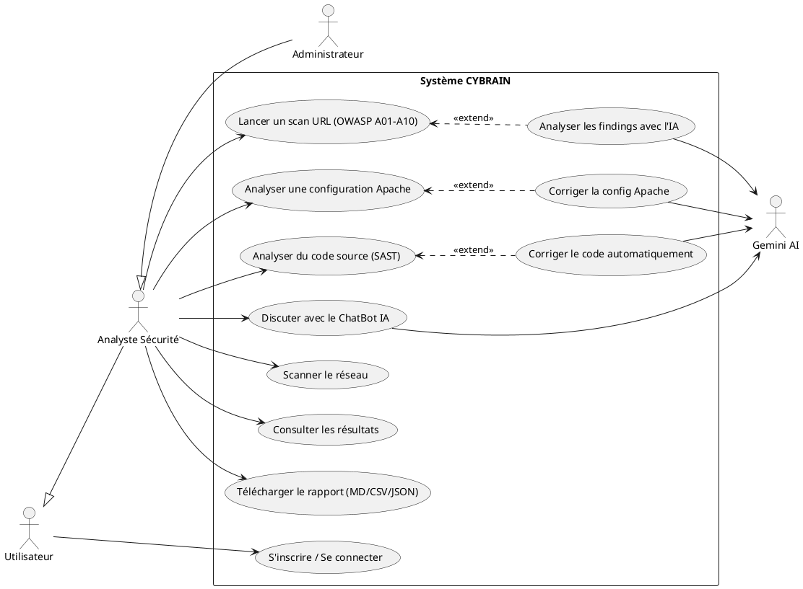
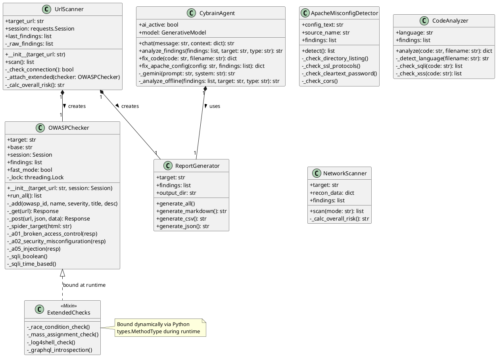
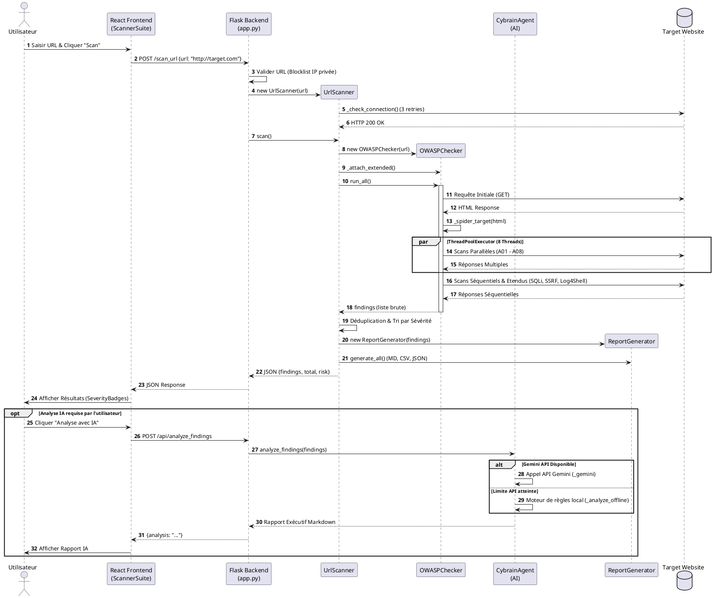

# CYBRAIN (Cyber Brain) v2.1
## Enterprise Security Intelligence Platform
**PFE Master 2 — Information Security**
**University of Mohamed Boudiaf, M'sila, Algeria**

---

## 1. PROJECT OVERVIEW & MOTIVATION

In an era characterized by an exponential rise in global cyberattacks, small to medium-sized enterprises (SMEs) and academic institutions often find themselves outpaced by sophisticated threat actors. The cybersecurity landscape is notoriously asymmetrical; attackers only need to find a single vulnerability, whereas defenders must secure the entire attack surface. While professional-grade security scanners like Nessus or Burp Suite Professional exist, they are often prohibitively expensive and require steep learning curves, effectively gatekeeping advanced security intelligence.

**CYBRAIN** was conceived to bridge this gap. By democratizing enterprise-grade security scanning, this project provides a unified, AI-powered platform that orchestrates multi-vector vulnerability assessments. The platform aligns strictly with the **OWASP Top 10 2025**, the definitive gold standard for web application security. 

The core academic contribution of CYBRAIN lies in its holistic synthesis: it combines automated OWASP testing, Static Application Security Testing (SAST), network reconnaissance, Apache configuration hardening, and generative AI analysis into a single, cohesive ecosystem. CYBRAIN acts as a force multiplier for developers, system administrators, and security teams. Furthermore, it incorporates strict ethical safeguards, such as private IP blocking and educational-use notices, ensuring that the platform is used responsibly without deploying destructive payloads.

---

## 2. ARCHITECTURE & TECHNOLOGY STACK

CYBRAIN employs a modern, decoupled architecture designed for high concurrency, modularity, and scalability.

### Frontend (React + Vite)
- **Framework:** React 18 leveraging functional components and hooks for a reactive user interface.
- **Build Tool:** Vite, which provides an ESBuild-powered compiler for rapid HMR (Hot Module Replacement) and optimized production builds.
- **Styling:** Tailwind CSS for a utility-first, highly responsive design system.
- **State & Routing:** React Router manages the Single Page Application (SPA) navigation across core modules (WebScan, ApacheScan, CodeScan, NetworkScan, etc.). 
- **API Integration:** Axios handles asynchronous HTTP communication with the backend. A custom `useScanner.js` hook encapsulates all API calls, managing loading states and error handling elegantly.
- **Architecture:** `logicProtection.js` centralizes critical constants, severity hierarchies, and endpoint definitions, promoting DRY principles.

### Backend (Flask + Python)
- **Framework:** Flask 3.x serves as the lightweight, high-performance API gateway, with `flask-cors` managing Cross-Origin Resource Sharing.
- **Production Server:** Gunicorn acts as the WSGI server for robust deployment on Render.com.
- **Concurrency Model:** A thread-safe architecture utilizing `threading.Lock()` protects shared vulnerability arrays during parallel scanning. Python's `ThreadPoolExecutor` dispatches up to 8 concurrent workers, drastically reducing scan times.
- **AI Optimization:** To mitigate API latency and costs, AI responses are cached using an MD5-hashed key mechanism with a 5-minute TTL and an LRU eviction policy (max 200 entries).

### Scanning Engines (7 Modular Python Engines)
1. `url_scanner.py` — Orchestrates web vulnerability scanning.
2. `owasp_checks.py` — Implements the massive logic for OWASP Top 10 2025 detection.
3. `detect_apache_misconf.py` — Analyzes and hardens Apache configurations.
4. `code_analyzer.py` — Drives the SAST (Static Application Security Testing) engine.
5. `network_scanner.py` — Coordinates network-level assessments.
6. `network_recon.py` — Performs footprinting (DNS, OS fingerprinting, port scanning).
7. `network_vulns.py` — Detects service-level vulnerabilities from recon data.

### AI Engine (`ai_agent.py`)
- **Primary Engine:** Google Gemini 2.0 Flash (via `google-generativeai` SDK) provides intelligent context-aware analysis.
- **Fallback Engine:** A pure-Python offline rule-based engine activates automatically if API limits are reached, ensuring zero-downtime availability.
- **Capabilities:** Chat assistance, executive findings analysis, automated code remediation, configuration hardening, and compliance mapping.

---

## 3. SCANNING MODULES — DEEP TECHNICAL EXPLANATION

### 3a. Web Vulnerability Scanner (`url_scanner.py` + `owasp_checks.py`)

This module executes a highly parallelized, multi-stage assessment pipeline:

**Step 1 — Target Validation:** 
Enforces strict scope rules. It blocks private IP subnets (e.g., `10.0.0.0/8`, `192.168.0.0/16`) and internal hostnames (`localhost`, `metadata.google.internal`) to prevent SSRF loops and unauthorized internal scanning. URLs are normalized automatically.

**Step 2 — Connection Verification:** 
Implements a robust 3-retry mechanism with a 1.5-second exponential backoff, resolving redirect chains to identify the true final endpoint.

**Step 3 — Target Spidering:** 
Parses HTML via regex to extract links, form actions, methods, and input fields. It features SPA (Single Page Application) heuristics to actively hunt for hidden `/api` and `/v1` endpoints if React, Angular, or Vue bundles are detected.

**Step 4 — Core OWASP Checks (8-Worker Thread Pool):**
- **A01 (Broken Access Control):** Probes for IDOR by mutating API IDs. Discovers administrative panels across 12 common paths (`/wp-admin`, `/console`). Analyzes HTML forms for missing CSRF tokens.
- **A02 (Security Misconfiguration):** Verifies 8 critical security headers (CSP, HSTS, X-Frame-Options). Tests over 60 sensitive file paths (`.env`, `.git/config`, `docker-compose.yml`) utilizing 20 threads, augmented by smart soft-404 detection to eliminate false positives. Flags CORS wildcard misconfigurations.
- **A03 (Software Supply Chain):** Performs component version detection (jQuery, React, Apache, Log4j). Maps detected versions to critical CVEs (e.g., Log4Shell CVE-2021-44228).
- **A04 (Cryptographic Failures):** Scans for plaintext HTTP traffic, missing `Secure`/`HttpOnly` cookie flags, and deeply analyzes JWTs for `alg:none` signature bypasses.
- **A05 (Injection):** Deploys comprehensive SQLi payloads (error-based, boolean-blind, time-based) across all discovered forms and URL parameters. Evaluates DOM, Reflected, and Stored XSS vectors. Tests for Command Injection, SSTI (Jinja2, Twig), and Path Traversal using advanced encodings (null bytes, double-URL encoding).
- **A06 (Insecure Design):** Triggers rate-limiting thresholds and user enumeration via differential response sizing on password reset endpoints.
- **A07 (Authentication Failures):** Brute-forces common default credentials concurrently. Evaluates session token entropy.
- **A08 (Integrity Failures):** Scans responses and cookies for raw serialized objects (Java `AC ED 00 05`, PHP `O:N:`).
- **A09 (Security Logging Failures):** Detects verbose exception stack traces (Werkzeug, Django debug) and exposed log files.
- **A10 (SSRF & Exceptions):** Fuzzes inputs with edge-case data (NaN, null bytes). Deploys 15 SSRF payloads targeting cloud metadata APIs (AWS, GCP).

**Step 5 — Extended Checks (Dynamic Injection):**
Utilizing Python metaprogramming (`types.MethodType`), extended checks are injected at runtime. This includes CWE-362 Race Condition testing (firing 15 simultaneous POST requests), Mass Assignment vulnerabilities, Log4Shell JNDI probes, and GraphQL introspection abuse.

**Step 6 — Post-processing:**
Findings are deduplicated using a set-based algorithm on titles. Vulnerabilities are sorted hierarchically (CRITICAL → INFO) and compiled into Markdown, CSV, and JSON reports with mapped CWEs and CVSS scores.

### 3b. Apache Misconfiguration Detector (`detect_apache_misconf.py`)

This engine performs deep static and semantic analysis of Apache `httpd.conf` and `.htaccess` files, executing 22 distinct security checks:
- **CWE-548:** Detects Directory Listing (`Options +Indexes`).
- **CWE-327:** Identifies weak SSL/TLS protocols (SSLv2, TLSv1.0) and deprecated cipher suites (RC4, DES).
- **CWE-798 (CRITICAL):** Scans for cleartext passwords embedded within the configuration.
- **CWE-770:** Checks for `LimitRequestBody = 0` (unlimited uploads leading to DoS) and excessively high Timeouts (Slowloris vectors).
- **Semantic Checks:** Validates directive dependencies (e.g., using `mod_rewrite` without `LoadModule`) and identifies unclosed `<VirtualHost>` tags.

### 3c. Static Application Security Testing — SAST (`code_analyzer.py`)

A white-box analyzer supporting PHP, Python, JavaScript, and Java. It uses regex-based AST-like pattern matching to detect over 20 vulnerability signatures:
- **Injection:** Unsanitized string concatenation in SQL queries; `eval()`, `system()`, and `shell_exec()` usage.
- **XSS & DOM:** `echo` without `htmlspecialchars`; dangerous `innerHTML` assignments.
- **Insecure Deserialization:** Usage of `pickle.loads()` or `unserialize()`.
- **JWT & Crypto:** `jwt.decode()` missing signature verification; usage of `md5()` or `sha1()`.

### 3d. Network Security Assessment (`network_scanner.py`)

Operates in three phases:
1. **Reconnaissance:** Executes DNS/Reverse DNS lookups, IPv6 detection, and GeoIP routing. Performs OS fingerprinting via TTL heuristics and banner analysis.
2. **Port Scanning:** Probes 80+ common ports using parallel sockets with aggressive timeouts. Validates SSL/TLS certificates on HTTPS ports.
3. **Vulnerability Mapping:** Extracts service banners to detect weak SSH algorithms, anonymous FTP access, exposed dangerous ports (RDP, SMB, Redis), and maps outdated services directly to known CVEs.

### 3e. AI Security Analysis Engine (`ai_agent.py`)

CYBRAIN employs a sophisticated dual-engine AI strategy:
- **Online Mode (Gemini 2.0 Flash):** A finely engineered prompt instructs the LLM to act as a "professional penetration tester." It digests up to 20 JSON findings and generates an executive Markdown report detailing compliance impacts (GDPR, PCI-DSS) and prioritized remediation strategies. It also powers the ChatBot, code-fixer, and Apache configuration hardener.
- **Offline Mode (Rule-Based Fallback):** If the API is unreachable or rate-limited, the system seamlessly falls back to a local CVE database. It calculates a definitive Security Score using the formula: `max(0, 100 - min(total_weight × 3, 95))`, ensuring offline availability and zero API quota consumption.

---

## 4. ALGORITHMS & DATA STRUCTURES

- **Boolean-Blind SQLi Detection:** 
  Measures a baseline response length for a valid parameter. It injects a `TRUE` condition (`AND 1=1`) and a `FALSE` condition (`AND 1=2`). The algorithm flags an injection if the `TRUE` payload response matches the baseline (`diff < 20 bytes`) while the `FALSE` payload diverges significantly (`diff > 100 bytes`).
- **Time-Based SQLi Detection:** 
  Injects sleep payloads (`SLEEP(3)`). A vulnerability is confirmed only if the elapsed response time is both strictly greater than 3.0s *and* greater than the baseline plus 2.4s. This dual-threshold mitigates false positives generated by inherently slow network conditions.
- **Thread-Safe Accumulation:** 
  Because 8 worker threads write findings simultaneously, all list appends are wrapped in a `threading.Lock()` to prevent race conditions and memory corruption.
- **Metaprogramming (Dynamic Method Injection):** 
  Extended checks are dynamically bound to the `OWASPChecker` instance at runtime using `types.MethodType`. This provides the injected methods full access to the instance's HTTP sessions and internal state without hardcoding them into the base class.

---

## 5. THEORETICAL FOUNDATIONS

CYBRAIN is deeply rooted in academic and industry standards:
- **OWASP Top 10 (2025):** CYBRAIN programmatically maps to categories A01 through A10.
- **CWE & CVSS v3.1:** Every finding is taxonomized with a MITRE CWE ID and scored using the Common Vulnerability Scoring System (evaluating Attack Vector, Attack Complexity, Privileges Required, User Interaction, Scope, Confidentiality, Integrity, and Availability).
- **Defense in Depth:** The platform executes a layered assessment methodology—probing the network infrastructure, web application layer, configuration files, and static source code simultaneously.
- **STRIDE Threat Modeling:** Findings translate directly into STRIDE categories (e.g., IDOR → Elevation of Privilege; Missing Security Logs → Repudiation).

---

## 6. DEPLOYMENT & INFRASTRUCTURE

- **Stateless Architecture:** CYBRAIN requires no traditional relational database for core scanning, opting for a stateless design where reports are generated ephemerally or stored flat. 
- **Frontend Hosting:** Deployed on Netlify's global edge CDN, utilizing automated GitHub Actions CI/CD pipelines.
- **Backend Hosting:** Deployed on Render.com, utilizing Gunicorn for robust process management and auto-scaling capabilities.
- **Environment Management:** API keys and sensitive flags are injected via `.env` files and Render's environment variable manager.

---

## 7. PRO VERSION FEATURES & FUTURE WORK

**Future Extensibility (Pro Tier Vision):**
- **CI/CD Integration:** Webhooks to break GitHub/GitLab pipelines upon detection of CRITICAL vulnerabilities.
- **Continuous Monitoring:** Scheduled cron-based scanning with differential regression reporting (detecting new vulnerabilities introduced between scans).
- **RBAC & Workspaces:** Multi-user environments for Red/Blue team collaboration and vulnerability lifecycle tracking.
- **Real-Time Streaming:** Transitioning from synchronous JSON responses to WebSocket-based real-time scan progress indicators.

**Current Limitations (Academic Disclosure):**
- Dynamic DOM XSS and SSRF checks on heavily obfuscated SPAs may yield false positives.
- Network scanning requires elevated OS privileges (root/admin) for raw socket manipulation, which can be restricted in sandboxed PaaS environments.

---

## 8. COMPARISON WITH EXISTING TOOLS

| Feature | CYBRAIN | Burp Suite Community | OWASP ZAP | Nessus |
|---------|---------|---------------------|-----------|--------|
| **Price** | Free | Free (Limited) | Free | $$$$ |
| **Web DAST** | ✓ Full OWASP | ✓ | ✓ | Partial |
| **SAST** | ✓ | ✗ | ✗ | ✗ |
| **Network Probing**| ✓ | ✗ | ✗ | ✓ |
| **AI Analysis** | ✓ Gemini / Offline | ✗ | ✗ | ✗ |
| **Reporting** | MD, CSV, JSON | HTML | HTML | PDF |
| **Architecture** | Serverless / SaaS | Desktop App | Desktop App | Enterprise Server|

CYBRAIN represents a paradigm shift for SMEs and academic environments: it requires zero installation time, provides unparalleled breadth (Network + DAST + SAST + Config), and leverages AI to translate complex technical findings into actionable, compliance-ready executive intelligence.

***

# CYBRAIN — UML DIAGRAMS

The following PlantUML diagrams illustrate the design, architecture, and behavioral flow of the CYBRAIN platform.

### DIAGRAM 1 — Diagramme de Cas d'Utilisation (Use Case Diagram)

**Explanation:** This use case diagram defines the system boundaries and actor interactions within CYBRAIN. It highlights how an authenticated Security Analyst interacts with the diverse scanning modules and how extended AI capabilities seamlessly integrate with core functionalities (e.g., code scanning optionally extending into AI remediation). It effectively demonstrates the platform's comprehensive feature set to the jury.

---

### DIAGRAM 2 — Diagramme de Classes (Class Diagram)

**Explanation:** This class diagram outlines the object-oriented structure of the Python backend. It illustrates the high cohesion within specialized scanner classes and emphasizes the dynamic injection of `ExtendedChecks` into the `OWASPChecker`. This architectural visualization proves to the jury that the codebase employs advanced software engineering patterns (like mixins and metaprogramming) for optimal modularity.

---

### DIAGRAM 3 — Diagramme de Séquence (Sequence Diagram)

**Explanation:** This sequence diagram traces the complete chronological lifecycle of a Web Vulnerability Scan. It effectively highlights asynchronous operations, the utilization of parallel threads for scanning (`ThreadPoolExecutor`), and the conditional failover logic within the AI engine. It provides the jury with a clear, step-by-step understanding of data flow and system interaction from the user interface down to the target network and back.
