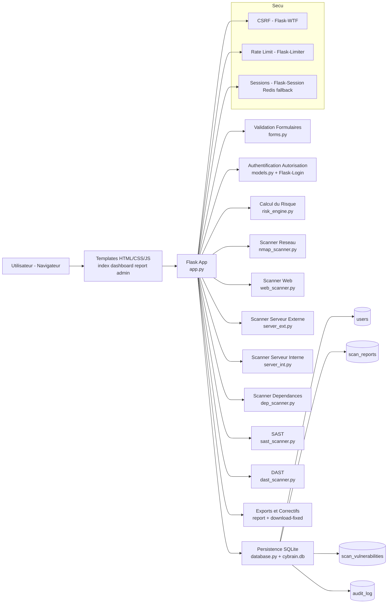

# CyBrain - Architecture + ERD + Contenu Pret pour Slides

## 1) Diagramme d'architecture (Mermaid)



## 2) ERD simplifie (Mermaid)

```mermaid
erDiagram
    USERS ||--o{ SCAN_REPORTS : "cree"
    SCAN_REPORTS ||--o{ SCAN_VULNERABILITIES : "contient"
    USERS ||--o{ AUDIT_LOG : "genere"

    USERS {
        int id PK
        string username UNIQUE
        string password_hash
        string role
        string permissions_json
        bool is_active
        datetime created_at
        datetime last_login
        int login_count
        int failed_attempts
        datetime locked_until
        string created_by
    }

    SCAN_REPORTS {
        int id PK
        string token UNIQUE
        int user_id FK
        string username
        string scan_type
        string target
        float risk_score
        int vuln_count
        int critical_count
        int high_count
        int medium_count
        int low_count
        text result_json
        text original_content
        datetime stored_at
    }

    SCAN_VULNERABILITIES {
        int id PK
        int report_id FK
        string check_name
        string severity
        string title
        text description
        text evidence
        text remediation
        int line_number
        string cve_ids_json
        bool is_fixed
        datetime fixed_at
        datetime found_at
    }

    AUDIT_LOG {
        int id PK
        datetime timestamp
        int user_id FK
        string username
        string action
        string category
        string resource
        string ip_address
        string user_agent
        string status
        text details
    }
```

## 3) Version slide-ready (copier coller direct dans PowerPoint)

### Slide 1 - Architecture globale
- CyBrain suit une architecture modulaire en 5 couches.
- Interface web (Templates + JS) connectee a Flask.
- Flask orchestre les scanners, le calcul de risque et le stockage.
- La base SQLite conserve rapports, vulnerabilites, utilisateurs et audit.

### Slide 2 - Couche applicative
- app.py centralise les routes et la logique de flux.
- forms.py valide les entrees utilisateur et fichiers uploades.
- models.py gere authentification, roles, permissions et lockout.
- risk_engine.py normalise le score de risque sur 10.

### Slide 3 - Couche scanning
- 7 moteurs de scan couvrent reseau, web, config serveur, deps, SAST, DAST.
- server_int.py supporte la correction automatique de configuration.
- Chaque moteur retourne un format standard de resultats.
- Le backend agrege et stocke les findings de facon homogene.

### Slide 4 - Securite applicative
- CSRF active sur les formulaires critiques.
- Rate limiting pour limiter brute force et abus.
- Sessions securisees avec fallback Redis vers memory en dev.
- Controle d acces par permissions sur les routes admin.

### Slide 5 - Base de donnees et logique
- users: identite, role, etat, traces de connexion.
- scan_reports: resultat global d un scan + score + compteurs.
- scan_vulnerabilities: details ligne par ligne des findings.
- audit_log: tracabilite complete des actions securite/admin.

### Slide 6 - Flux end-to-end
- L utilisateur lance un scan depuis l interface.
- Flask valide et appelle le scanner approprie.
- Le score est calcule puis enregistre avec les findings.
- Le rapport est affiche, et un fichier corrige peut etre telecharge.

### Slide 7 - Limites actuelles
- Couverture de tests encore perfectible sur certains cas limites.
- Robustesse production a renforcer (observabilite avancee).
- Export PDF peut encore etre enrichi en mise en forme.

### Slide 8 - Perspectives
- Ajouter de nouvelles regles CIS/OWASP prioritaires.
- Renforcer les tests de non regression automatiques.
- Consolider une demo soutenance stable scan-correction-rescan.
- Evoluer vers un deploiement production plus durci.
