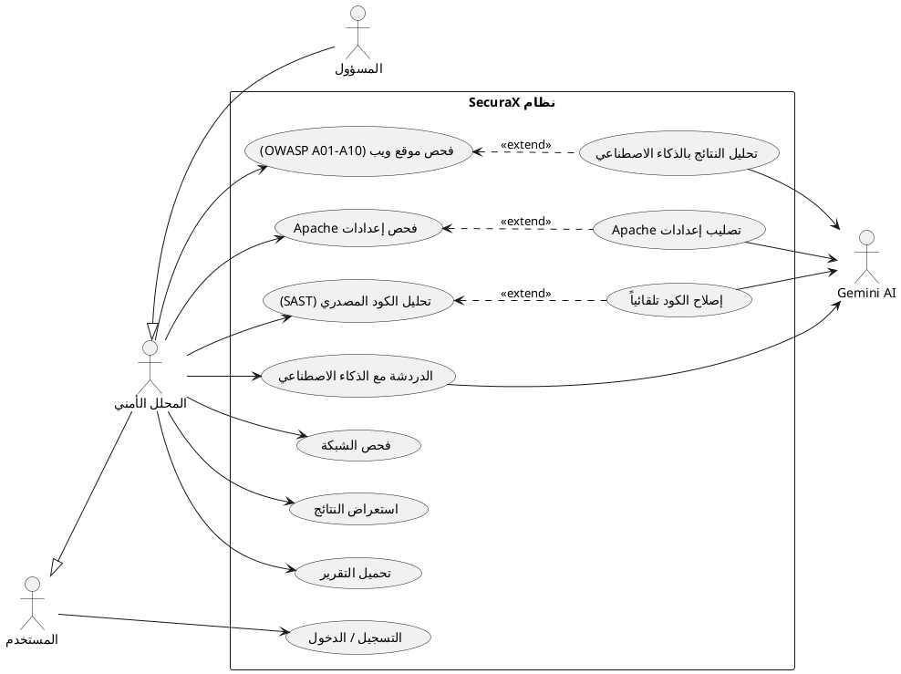
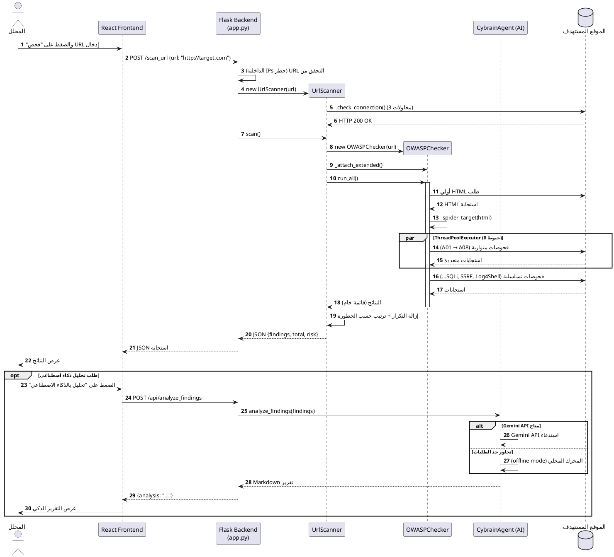
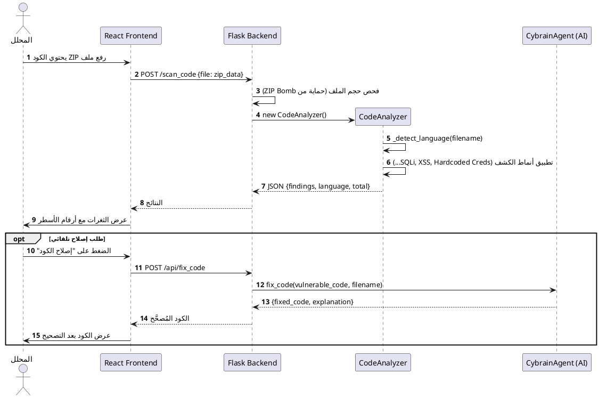
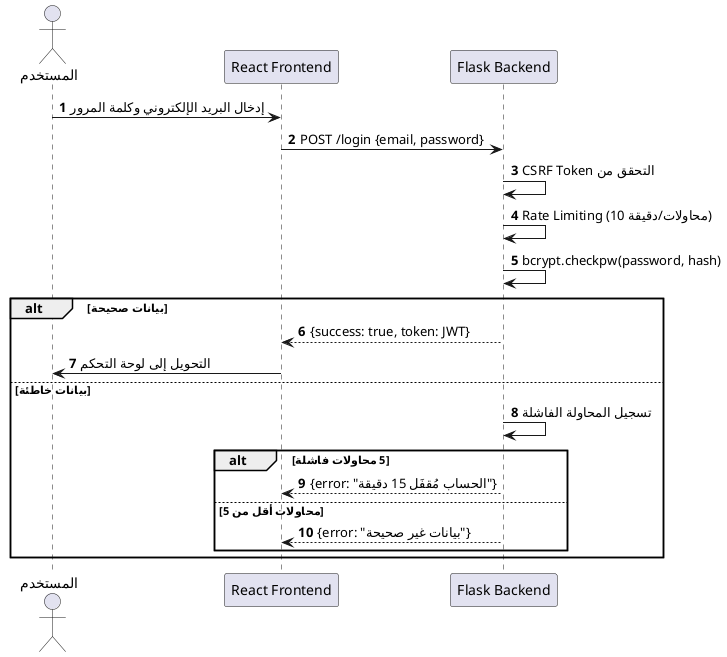
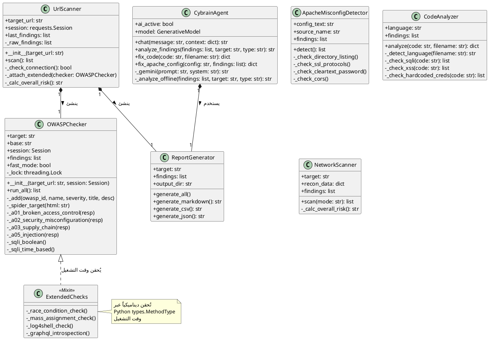

# الفصل الثاني: تحليل وتصميم نظام SecuraX

---

## 1. مقدمة

قبل أن يُكتب أي سطر كود، لا بد من فهم النظام بشكل كامل: من يستخدمه؟ ماذا يحتاج؟ كيف تتفاعل مكوناته مع بعض؟ هذه المرحلة — التحليل والتصميم — هي التي تُحدد إذا كان المشروع سيُبنى على أسس صحيحة أم لا.

في هذا الفصل، نعرض البنية المعمارية الكاملة لـ **SecuraX**، ومخططات الحالات (Use Cases)، ومخططات التسلسل (Sequence Diagrams)، ومخططات الفئات (Class Diagrams) — كل ذلك بأسلوب يُوضّح للمستخدم والمطور والمُحكِّم كيف يعمل النظام من الداخل.

---

## 2. نموذج C4 للمعمارية

نعتمد نموذج **C4** (Context, Containers, Components, Code) لوصف المعمارية بشكل تدريجي من المستوى الأعلى إلى الأكثر تفصيلاً.

### 2.1 مخطط السياق (Context Diagram)

يُبيّن هذا المخطط موقع SecuraX بالنسبة للمستخدمين والأنظمة الخارجية:

```
                     ┌─────────────────────────────────┐
                     │                                 │
  [محلل أمني]  ──── │         منصة SecuraX            │ ──── [Gemini AI API]
  [مطور ويب]   ──── │   (نظام كشف ثغرات متكامل)       │ ──── [NIST NVD API]
  [مدير نظام]  ──── │                                 │
                     └─────────────────────────────────┘
                                    │
                                    ▼
                          [الهدف المفحوص]
                     (موقع ويب / كود مصدري / شبكة)
```

**الأطراف المتفاعلة:**
- **المستخدمون:** محلل أمني، مطور ويب، مسؤول نظام، طالب أمن
- **أنظمة خارجية:** Google Gemini API (الذكاء الاصطناعي)، NIST NVD (قاعدة بيانات الثغرات الرسمية)
- **الهدف المفحوص:** موقع ويب، ملف كود، ملف إعداد Apache، أو شبكة

### 2.2 مخطط الحاويات (Container Diagram)

```
┌─────────────────────────────────────────────────────────────┐
│                        منصة SecuraX                         │
│                                                             │
│   ┌──────────────────┐         ┌──────────────────────┐    │
│   │   واجهة أمامية  │  HTTP   │    خادم الخلفية      │    │
│   │  (React + Vite)  │ ──────▶ │   (Flask + Python)   │    │
│   │  Netlify CDN     │         │   Render.com          │    │
│   └──────────────────┘         └──────────────────────┘    │
│                                          │                   │
│                          ┌───────────────┼──────────────┐   │
│                          ▼               ▼              ▼   │
│                  ┌─────────────┐ ┌──────────────┐ ┌──────┐ │
│                  │ محركات الفح│ │  محرك الذكاء  │ │تقارير│ │
│                  │     ص (7)  │ │  الاصطناعي    │ │ MD/  │ │
│                  │  Python    │ │ (ai_agent.py) │ │CSV/  │ │
│                  └─────────────┘ └──────────────┘ │JSON) │ │
│                                                    └──────┘ │
└─────────────────────────────────────────────────────────────┘
```

---

## 3. الخادم الخلفي (Backend) — التفاصيل

### 3.1 المكونات الرئيسية للنظام

يتكون الخادم الخلفي من المكونات التالية:

| المكوّن | الملف | الوظيفة |
|---------|------|---------|
| نقطة الدخول الرئيسية | `app.py` | إدارة المسارات والـ API |
| ماسح الويب | `url_scanner.py` | تنسيق فحص OWASP |
| فحوصات OWASP | `owasp_checks.py` | تطبيق الـ A01–A10 |
| كاشف إعدادات Apache | `detect_apache_misconf.py` | تحليل ملفات الإعداد |
| محلل الكود (SAST) | `code_analyzer.py` | فحص الكود المصدري |
| ماسح الشبكة | `network_scanner.py` | تنسيق فحص الشبكة |
| استطلاع الشبكة | `network_recon.py` | DNS، OS، المنافذ |
| ثغرات الشبكة | `network_vulns.py` | كشف ثغرات الخدمات |
| الذكاء الاصطناعي | `ai_agent.py` | Gemini + الوضع المحلي |

### 3.2 طبقة قاعدة البيانات

النظام في نسخته الحالية **بدون قاعدة بيانات تقليدية** — وهو قرار معماري مدروس. بدلاً من تخزين النتائج في قاعدة بيانات، تُحفظ التقارير كملفات في مجلد `/reports` بصيغ Markdown وCSV وJSON. هذا يُبسّط النشر كثيراً ويتوافق مع مبدأ "الحالة اللاذاكرية" (Stateless Architecture).

### 3.3 الفهرسة والربط بين المكونات

```
app.py (Flask Router)
    │
    ├── POST /scan_url ──────── url_scanner.py ──── owasp_checks.py
    │                                          └─── report_generator.py
    │
    ├── POST /scan_apache ────── detect_apache_misconf.py
    │
    ├── POST /scan_code ─────── code_analyzer.py
    │
    ├── POST /scan_network ──── network_scanner.py ── network_recon.py
    │                                              └── network_vulns.py
    │
    ├── POST /api/analyze ────── ai_agent.py (Gemini أو Offline)
    │
    └── POST /api/chat ───────── ai_agent.py (chat mode)
```

---

## 4. مخطط العلاقات بين الكيانات (Entity Relationship)

رغم أن النظام الحالي لا يستخدم قاعدة بيانات، إلا أن النسخة المستقبلية (Pro Version) ستحتاجها. هنا نوثّق البنية المفترضة:

```
┌─────────────┐         ┌───────────────────┐         ┌────────────────┐
│    User     │ 1 ── * │    ScanReport      │ 1 ── * │    Finding     │
├─────────────┤         ├───────────────────┤         ├────────────────┤
│ id          │         │ id                │         │ id             │
│ email       │         │ user_id (FK)      │         │ report_id (FK) │
│ password    │         │ target            │         │ owasp_id       │
│ role        │         │ scan_type         │         │ title          │
│ created_at  │         │ risk_level        │         │ severity       │
└─────────────┘         │ findings_count    │         │ description    │
                        │ ai_analysis       │         │ cwe_id         │
                        │ created_at        │         │ cvss_score     │
                        └───────────────────┘         └────────────────┘
```

---

## 5. تحليل النظام باستخدام مخططات الحالات (Use Case Diagrams)

### 5.1 الأطراف الفاعلة والحالات

حددنا ثلاثة أنواع من المستخدمين:

- **المستخدم العادي (User):** يمكنه التسجيل والدخول والاطلاع على الواجهة
- **المحلل الأمني (Analyst):** يشغّل الفحوصات ويستعرض النتائج ويستخدم الذكاء الاصطناعي
- **المسؤول (Admin):** يُدير المستخدمين والنظام ويطّلع على سجلات النشاط

### 5.2 مخطط الحالات — المحلل الأمني



**شرح المخطط:** يُوضح هذا المخطط كيف يتفاعل المحلل الأمني مع الوظائف الأساسية للنظام، وكيف تمتد بعض الوظائف (مثل إصلاح الكود) كتوسعة اختيارية للوظائف الأصلية (مثل فحص الكود).

### 5.3 مخطط الحالات — المسؤول

المسؤول يرث كل صلاحيات المحلل، ويُضاف إليها:
- إدارة المستخدمين (إضافة، حذف، تعديل الصلاحيات)
- مراجعة سجل التدقيق (Audit Log)
- مراقبة إحصاءات النظام

---

## 6. تحليل النظام بمخططات التسلسل (Sequence Diagrams)

### 6.1 تسلسل فحص الموقع (Web URL Scan)



### 6.2 تسلسل فحص الكود المصدري (SAST)



### 6.3 تسلسل تسجيل الدخول والمصادقة



---

## 7. تحليل النظام بمخطط الفئات (Class Diagram)



**شرح المخطط:** يُظهر هذا المخطط البنية الكائنية للنظام. الملاحظة الأهم هي الطريقة الديناميكية التي يُحقَن بها `ExtendedChecks` في `OWASPChecker` وقت التشغيل باستخدام `types.MethodType` — وهو نمط برمجي متقدم يوفر مرونة كبيرة دون تعقيد الكلاس الأصلي.

---

## 8. الخاتمة

في هذا الفصل قدّمنا الصورة الكاملة لتصميم SecuraX: من أعلى مستوى (مخطط السياق) وصولاً إلى تفاصيل الكلاسات والتسلسلات. هذا التصميم ليس نظرياً فحسب — بل هو ما يعمل فعلاً في النظام الذي طورناه وسنشرحه في الفصول التالية.
